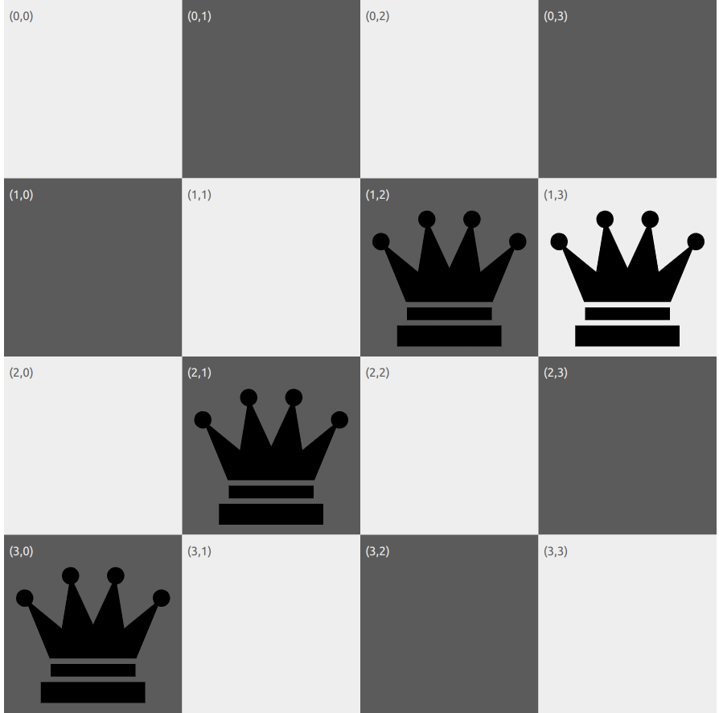
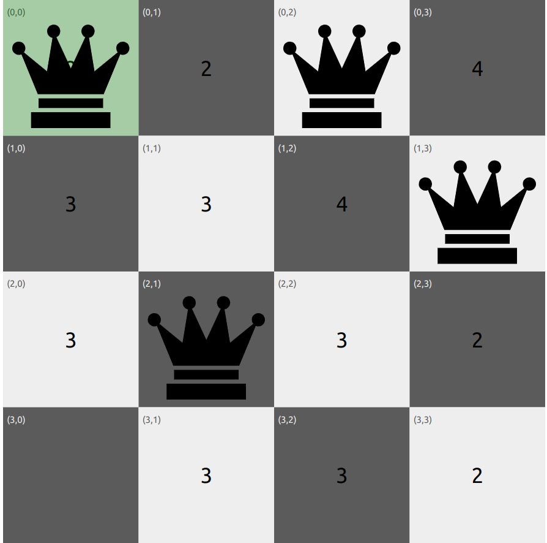
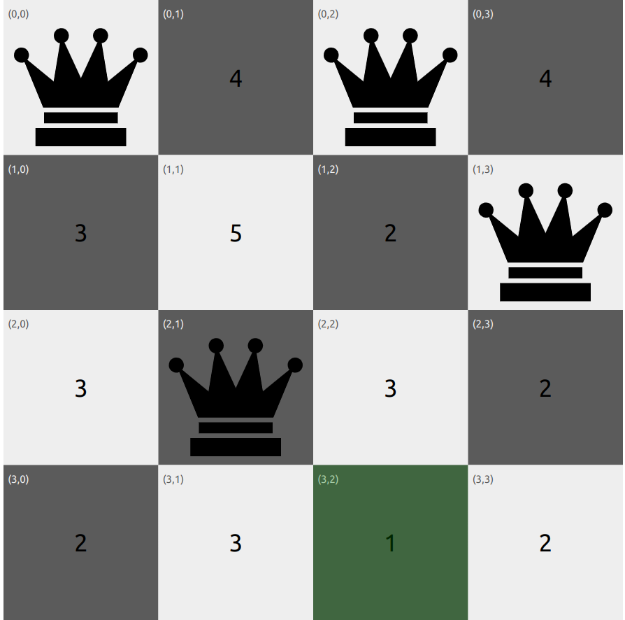
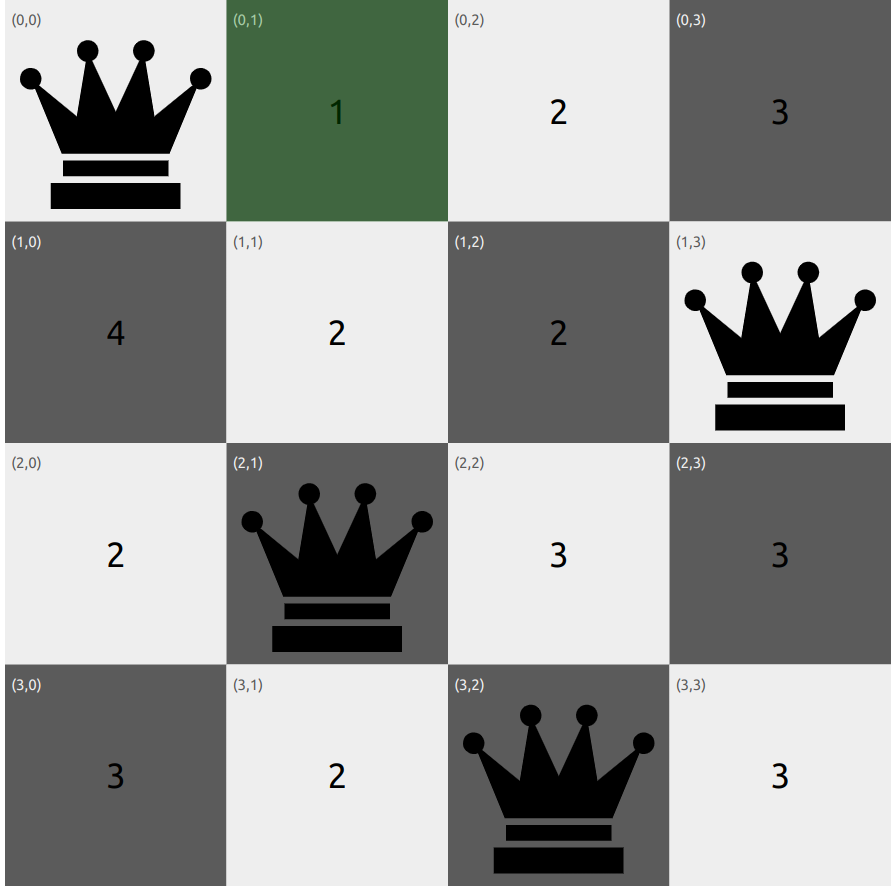
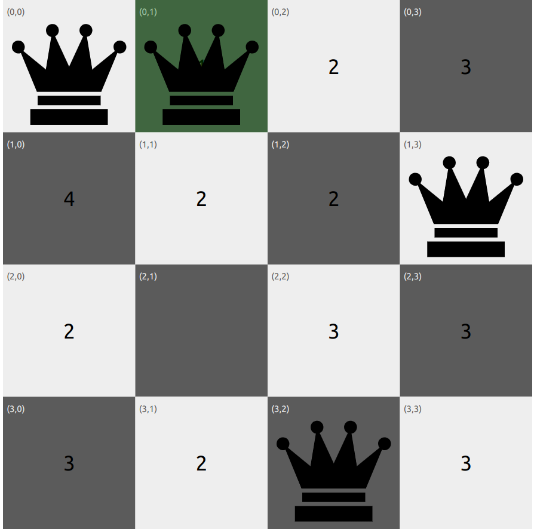

# Hill Climbing

## Introduction to Hill Climbing
Hill climbing algorithm (steepest ascent) is a local search algorithm which continuously moves in the direction of increasing elevation/value to find the peak of the hill or best solution to the problem. It terminates when it reaches a peak value where no neighbor has a higher value.  
It is also called greedy local search. This is becasue Hill Climbing only looks to its best immediate neighbor state and not beyond that. The algorithm does not maintain a search tree, so the data structure for the current node only needs to record the state and the value of the objective function.  
The steepest descent algorithm is the opposite of the steepest ascent algorithm, where the algorithm moves in the direction of decreasing elevation/value to find the lowest point or best solution to the problem.

### N Queens Example

* The goal of the 8-queens problem is to place eight queens on a chessboard such that no queen attacks any other. (A queen attacks any piece in the same row, column or diagonal) 
* There are two types of formulations:
    * An **incremental formulation** that uses operators to progressively expand or enhance the state description, starting with an empty state; for the N queens problem, this means that each action adds a queen to the state. 
    * A **complete-state formulation** starts with all 8 queens on the board and moves them around.
* This experiment uses a **complete-state formulation**, where each state has 8 queens on the board, one per column. The successors of a state are all possible states generated by moving a single queen to another square in the same column (so each state has 8 × 7 = 56 successors). 

### The Heuristic Function
* The heuristic cost function h is the number of pairs of queens that are attacking each other, either directly or indirectly, that is, the number of pairs of queens that are on the same row, column, or diagonal.
* The aim of the algorithm is to minimize the heuristic cost function h, which is 0 when the state is a solution to the problem.

### Algorithm Steps
1. **Initialization:** Start with a random state.
2. **Successor Generation:** Generate all possible successor states by moving a single queen to another square in the same column.
3. **Selection:** Choose the best successor state with the lowest heuristic cost.
4. **Termination:** If the selected state is the goal state (h = 0), terminate the algorithm; otherwise, repeat steps 2-3.

**Tie Breaking**: Hill-climbing algorithms typically choose randomly among the set of best successors if there is more than one.

## Example Problem
Consider the 4-queens problem shown below. The heuristic function h is the number of pairs of queens that are attacking each other, either directly or indirectly.  
The aim of the algorithm is to minimize the heuristic cost function h, which is 0 when the state is a solution to the problem.   
Below is the initial state of the 4-queens problem, where each queen is placed in a different column. The heuristic cost function h = 4, as there are 4 pairs of queens that are attacking each other.
### Initial State:

### Iteration 1:
As we can see from the picture below, the neighbouring state with h = 2 is selected as the next state. The algorithm continues to select the best neighbour until it reaches the goal state with h=0. 

### Iteration 2:
In the second iteration, the algorithm selects the state with h = 2 again as sideways moves are allowed. This is because the algorithm is stuck at a local optima and needs to explore other states to reach the global optima. If sideways moves were not allowed, the algorithm would have terminated at the state with h = 2.

### Iteration 3:

### Iteration 4:

### Iteration 5:
The algorithm find the neighbour state with h = 0 and terminates as it is the goal state.

### Solution:
The algorithm reaches the goal state with h = 0, where no queens are attacking each other. The final state is the solution to the 4-queens problem.

### Disadvantages
Though Basic Hill Climbing reaches a soluion quickly, it can often get stuck due to the following reasons:
1. **Local Optima**: It may get stuck at a local optima and not reach the global optima. A local optima is a peak that is higher than each of its neighboring states but lower than the global maximum. Hill-climbing algorithms that reach the vicinity of a local maximum will be drawn upward toward the peak but will then be stuck with nowhere else to go.
2. **Ridges**: Ridges result in a sequence of local optima that is very difficult for greedy algorithms to navigate.
3. **Plateaux**: It can be a flat local optima, from which no uphill/downhill exit exists, or a **shoulder**, from which progress is possible. A hill-climbing search might get lost on the plateau.

The above image corresponds to a steepest ascent hill climbing algorithm.  
Reference: Figure 4.1 of Reference 1

**Sideways Move**: Basic Hill Climbing stops if it reaches a plateau where the best successor has the same value as the current state. A **sideways move** does not terminate in this case in the hope that the plateau is really a shoulder and a better state can be reached after more steps. This could however lead to an infinite loop.

## Hill Climbing Variants
Other variants of Hill Climbing have been developed to overcome these limitations, such as:

1. **Stochastic Hill Climbing**: The algorithm chooses at random from among the uphill moves; the probability of selection can vary with the steepness of the uphill move. This usually converges more slowly than steepest ascent, but in some
state landscapes, it finds better solutions.
2. **First-choice Hill Climbing**: First-choice hill climbing implements  stochastic hill climbing by generating successors randomly until one is generated that is better than the current state. This is a good strategy when a state has many (e.g., thousands) of successors.
3. **Random-Restart Hill Climbing**: It conducts a series of hill-climbing searches from randomly generated initial states until a goal is found.If each hill-climbing search has a probability p of success, then the expected number of restarts required is 1/p. 

### Convergence and Optimality

As explained above, Hill Climbing can converge to a local optima instead of a global optima. Numerous strategies have been developed to address this.

## Pseudo Code

